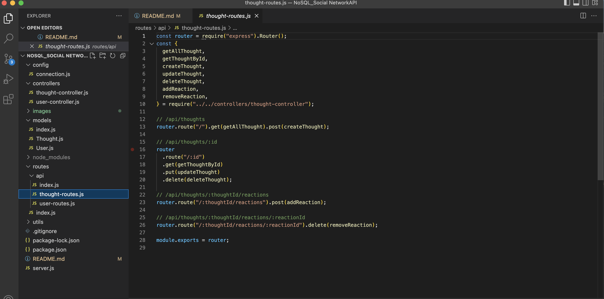

# NoSQL-Social-Network-API

## Table of Content
* [ User Story ](#User-Story)
* [ Technologies ](#Technologies)
* [ License ](#License)
#

## Project Objective
To create a Social Network API using a NoSQL database, so that the website will handle large amounts of unstructured data; we will be able to add, update, delete and view specific information using the POST, PUT, DELETE AND GET methods. The specific information that we will be manipulating will be a user, a friend for a user, a thought for a user, a reaction for a thought. Also whenever we delete a user, their associated thoughts will do as well! 

## User Story
AS A social media startup, I WANT an API for my social network that uses a NoSQL database, SO THAT my website can handle large amounts of unstructured data.

## Technologies 
```
Node.js, JavaScript, Express, MongoDB, Mongoose
```
## video deployed link:
(https://drive.google.com/file/d/1yNdh27dDkhDHJTkf7Xz9zOlwcHk8KBGf/view)

## Screenshots





## License
This project is [MIT](https://choosealicense.com/licenses/mit/) licensed.

